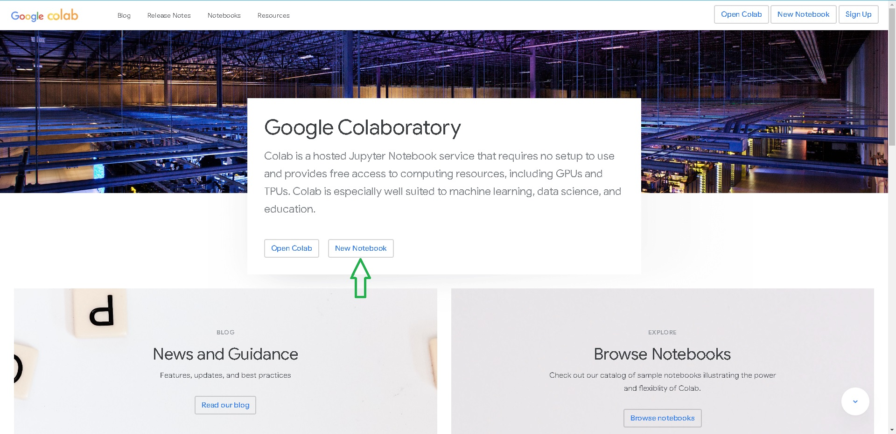
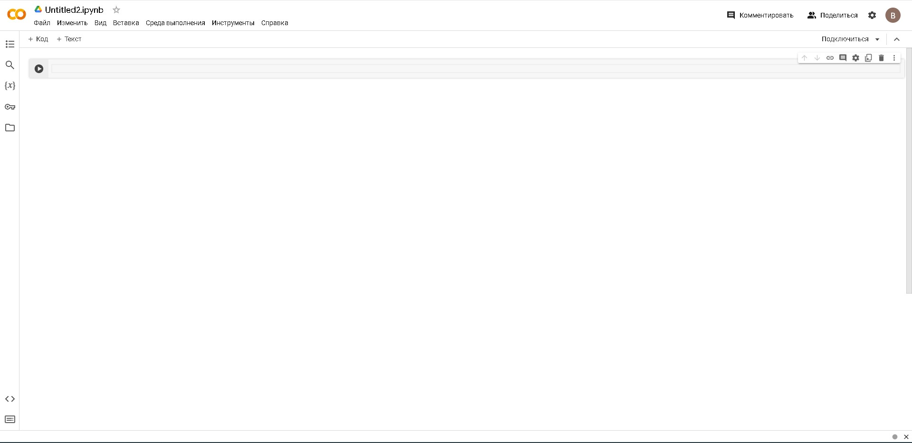
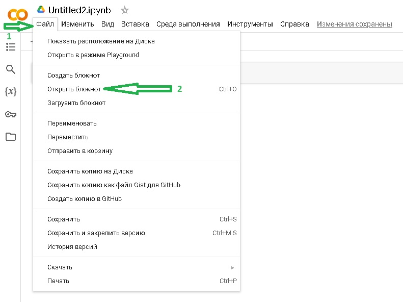
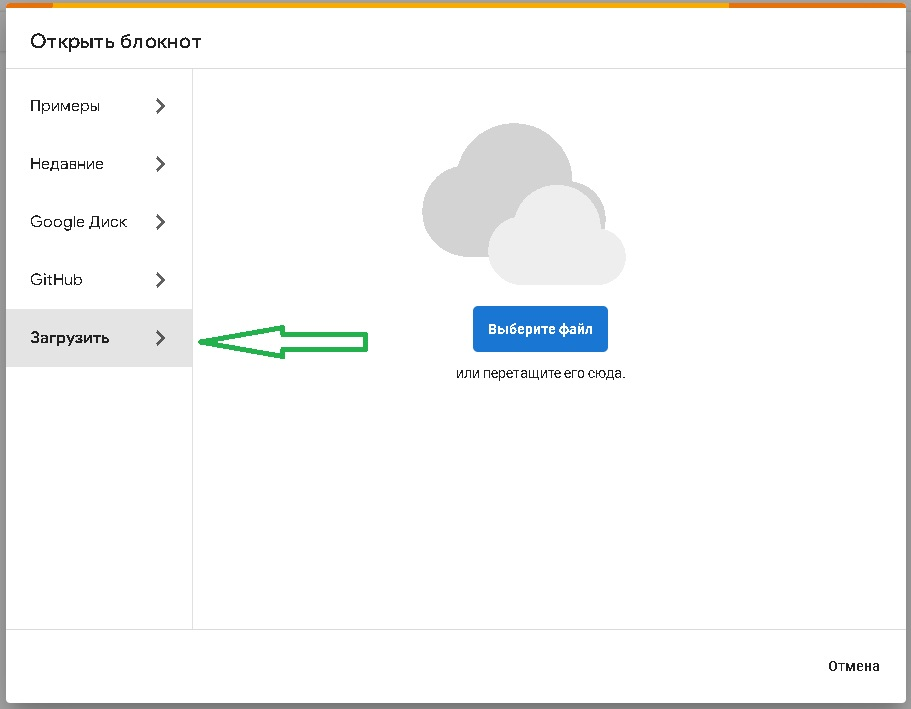
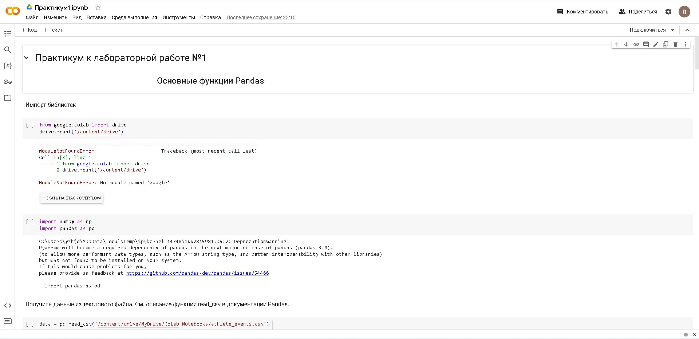
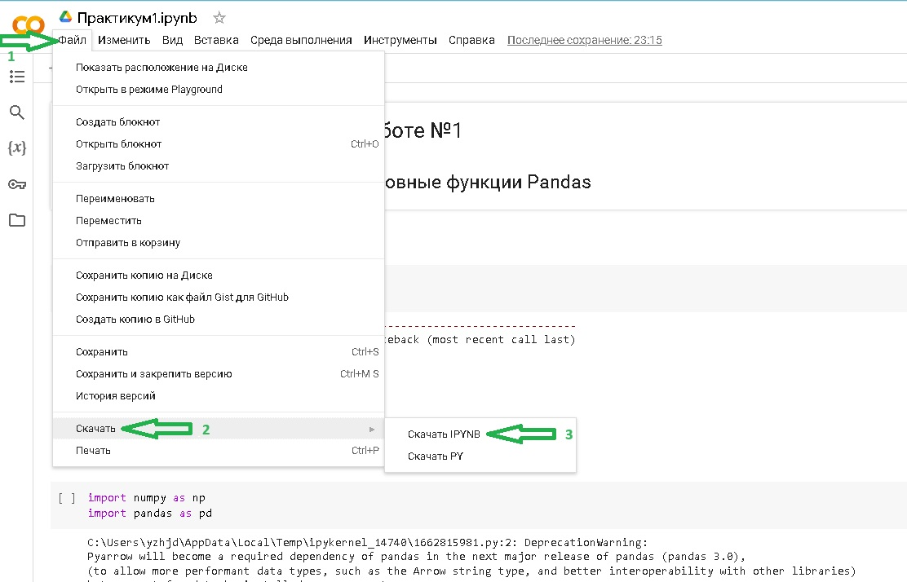
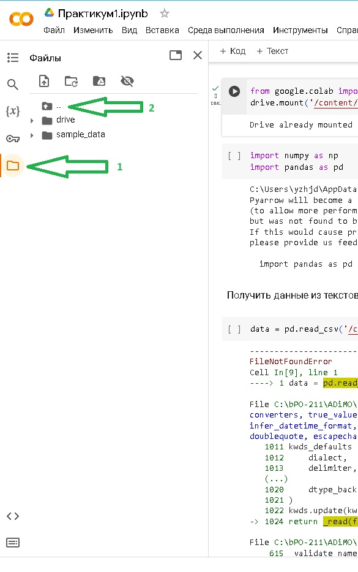
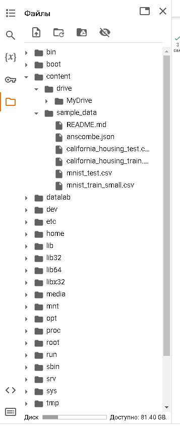

# Настройка Google Colab
В рамках лабараторной работы №1 предоставляется\
тестовый файл "Практикум1.ipynb". Он является\
методичкой для выполнения этой работы, показывая\
при этом как работает файл .ipynb.

## Прямая загрузка файла с локального диска

1. Необходимо перейти на сайт [Google Colab](https://colab.google/)

   

2. Затем нажать на кнопку *New Notebook*

Откроется пустой .ipynb файл.

   

3. Далее нажать "Файл->Открыть блокнот"

   

    3.1. В открывшемся окне открыть вкладку "Загрузить" и выбрать файл "Практикум1.ipynb"
    
      

4. В результате загрузится и откроется файл "Практикум1.ipynb". Теперь можно работать,\
учитывая, что в конце работы необходимо экспортировать результаты работы.

   


## Экспортирование результатов работы
Чтобы не потерять результаты работы необходимо экспортировать их из\
виртуальной машины. Для этого необходимо:
1. Открыть меню "Файл->Скачать->Скачать IPYNB"

   

2. Файл .ipynb будет скачан в папку для загрузок.


## Подключение Google Drive
Подключение Google Drive позволяет загружать файлы .ipynb из него на шаге 3.1\
из инструкции "Прямая загрузка файла с локального диска". А также экспортировать\
результаты работы сочетанием клавиш Ctrl+S или пунктом меню "Файл->Сохранить".\
Для подключения облачного хранилища необходимо:
1. Авторизоваться в Google аккаунте.
2. Запустить секцию кода с подключением Google Drive.

   Если ее нет, то добавить в ручную.
   ```
   > from google.colab import drive
   > drive.mount('/content/drive')
   ```
3. При ее выполнении откроется окно подключения диска:

   
   
   Необходимо нажать "Подключится к Google Диску"
   
4. Пройти стандартную процедуру выдачи прав сервисам в открывшемся окне браузера.
5. Гугл диск подключен к сессии Google Drive.


Стоит учитывать, что сервис работает на базе виртуальной машины, которая запущена с ОС Linux.\
Для просмотра файловой системы можно обратиться к левому боковому меню:\
   \
Файлы из вашего дискра расположены по пути */content/drive/MyDrive/** \
Файлы, созданныев рамках сессии виртуальной машины: */content/sample-data/** \
   \
Эти пути необходимо учитывать при написании Python-скрипта, например:
```
> pd.read_csv('/content/drive/MyDrive/Colab Notebooks/athlete_events.csv')
```
   
