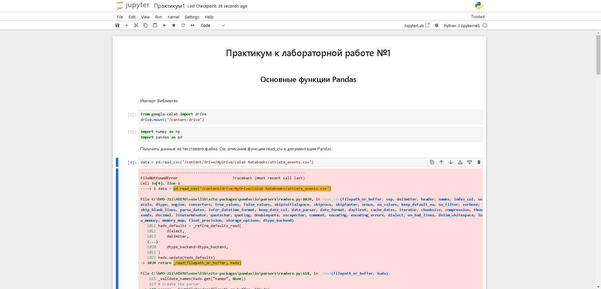

# Работа с  Jupyter Notebook
Для работы с Jupyter Notebook требуется установленный Python\
со всеми зависимостями, требуемыми для работы. К слову, Jupyter Notebook\
является одной из таких. Для помощи с этим можно обратиться к
[инструкции.](python.md "Инструкция по работе с Python")

## Запуск Jupyter Notebook
Для запуска Jupyter Notebook необходимо выполнить команду
```
> jupyter-notebook
```
После этого откроется окно браузера с файловым менеджером с корневой папкой\
совпадающей с той, из которой запущена командная строка. Поэтому необходимо\
учитывать этот момент заранее, до запуска программы.\
Далее можно перемещаться по доступному участку файловой системы и открывать\
необходимые .ipynb файлы. После открытия файла откроется стандартное окно\
для просмотра таких файлов:



## Особенности работы
В примерах методички и шаблонных файлах лабораторных работ\
может быть вставлен платформозависимый код. А именно:
```
> from google.colab import drive
> drive.mount('/content/drive')
```
и путь к датасету:
```
> data = pd.read_csv('/content/drive/MyDrive/Colab Notebooks/athlete_events.csv')
```
Первые строчки можно удалить или закомментировать:
```
> #from google.colab import drive
> #drive.mount('/content/drive')
```
А путь к датасету полностью изменить:
```
> data = pd.read_csv('C:/bPO-211/ADiMO/lr1/athlete_events.csv')
```
