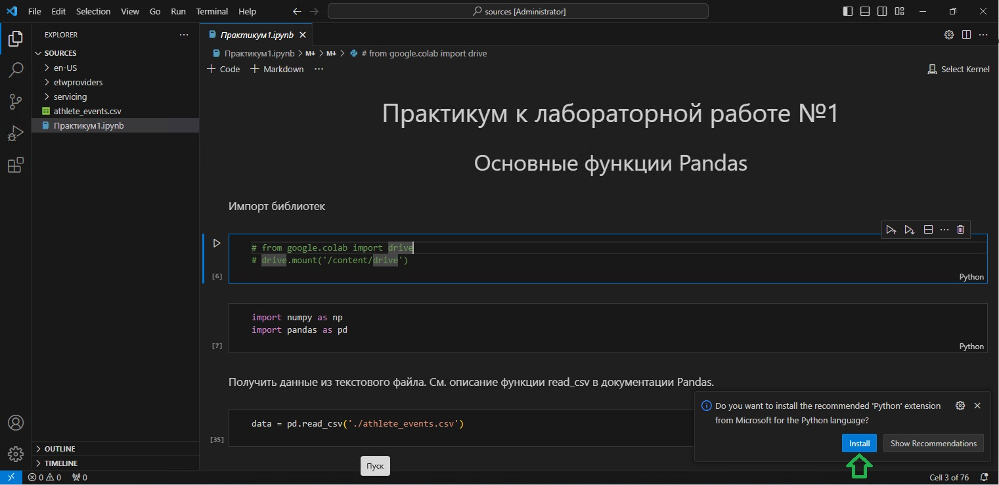

# Работа в VS Code
Для работы в VS Code требуется установленный Python\
со всеми зависимостями, требуемыми для работы.\
Для помощи с этим можно обратиться к
[инструкции.](python.md "Инструкция по работе с Python")

## Первая настройка VS Code
Необходимо открыть .ipynb файл либо напрямую из контекстного меню\
проводника или из рабочей папки, открытой в VS Code. При открытии\
программа автоматически предложит установить необходимые расширения\
в правом нижнем углу.\
\
Среди таких всего две:
- для работы с Python
- для поддержки Jupyter

## Особенности работы
В примерах методички и шаблонных файлах лабораторных работ\
может быть вставлен платформозависимый код. А именно:
```
> from google.colab import drive
> drive.mount('/content/drive')
```
и путь к датасету:
```
> data = pd.read_csv('/content/drive/MyDrive/Colab Notebooks/athlete_events.csv')
```
Первые строчки можно удалить или закомментировать:
```
> #from google.colab import drive
> #drive.mount('/content/drive')
```
А путь к датасету полностью изменить:
```
> data = pd.read_csv('C:/bPO-211/ADiMO/lr1/athlete_events.csv')
```


